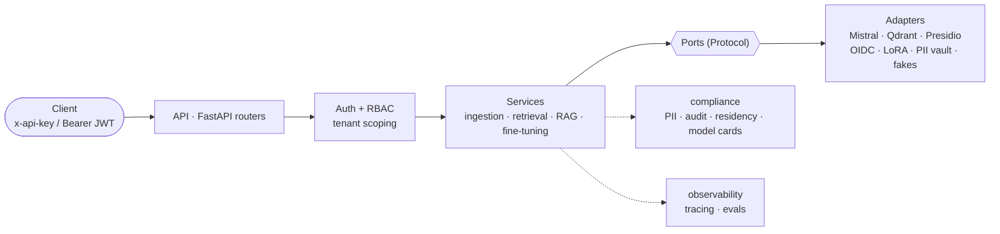

# Sovereign RAG

[](https://github.com/SeydinaBANE/sovereign-rag/actions/workflows/ci.yml)
[](https://github.com/SeydinaBANE/sovereign-rag/actions/workflows/release.yml)
[](https://github.com/SeydinaBANE/sovereign-rag/releases)
[](LICENSE)
[](pyproject.toml)
[](pyproject.toml)
[](pyproject.toml)
[](https://github.com/SeydinaBANE/sovereign-rag/pkgs/container/sovereign-rag)

A **sovereign, compliance-by-design RAG accelerator** for enterprise environments.

Built to demonstrate a production-grade reference architecture: **Mistral** LLM,
self-hostable **Qdrant** vector search, **PII masking**, **hash-chained audit log**,
**data-residency** guardrails, **AI Act model cards**, and **LLMOps observability**
(tracing + automated evals). Every external dependency sits behind a typed **port**,
so providers are swappable and nothing is locked to a non-sovereign vendor.

## Why this exists

| Offer requirement | Where it lives |
|---|---|
| LLM orchestration | `services/rag.py`, `ports/llm.py`, `adapters/mistral_llm.py` |
| Vector search | `services/retrieval.py`, `adapters/qdrant_store.py` |
| Hybrid search (BM25 + RRF + rerank) | `adapters/bm25.py`, `services/fusion.py`, `adapters/*_reranker.py` |
| Persistent hybrid (Qdrant sparse vectors) | `adapters/qdrant_hybrid.py`, `adapters/sparse_embeddings.py` |
| LLM fine-tuning (LoRA: Mistral / on-prem) | `services/fine_tuning.py`, `ports/fine_tuning.py`, `adapters/mistral_fine_tuning.py`, `adapters/local_lora.py` |
| Observability / MLOps | `observability/tracing.py`, `observability/evals.py` |
| Security & guardrails | `adapters/presidio_guardrail.py`, `services/rag.py` |
| Reversible PII vault (tokenize/detokenize) | `ports/vault.py`, `adapters/pii_vault.py`, `api/routers/pii.py` |
| RBAC + multi-tenant isolation | `domain/access.py`, `services/access_control.py`, `api/security.py` |
| Auth providers (API key / JWT-OIDC) | `ports/auth.py`, `adapters/principals.py`, `adapters/oidc_principals.py` |
| GDPR / AI Act / Data Act | `compliance/` + `docs/compliance/ai-act-mapping.md` |
| Sovereign cloud | `memory`/`qdrant` stores, local embeddings, `docker-compose.yml` |
| Reusable accelerator | hexagonal layering, ports/adapters, typed everywhere |

## Architecture

Hexagonal. The **domain** depends on nothing. **Services** depend on **ports**
(`Protocol`s). **Adapters** implement ports. Compliance and observability are
cross-cutting concerns injected into services. See [`docs/architecture.md`](docs/architecture.md).



## Quickstart (no external services)

The defaults (`SRAG_*_PROVIDER=fake/memory`) run the full pipeline with deterministic
in-memory fakes — no API keys, no Docker needed.

```bash
make install
cp .env.example .env
make demo          # ingest sample corpus, ask grounded + out-of-scope + PII questions
make test          # unit + integration
make lint typecheck
```

## Run the API

```bash
make run           # http://localhost:8000/docs
```

Key endpoints: `POST /ingest`, `POST /query`, `GET /compliance/card`,
`POST /fine-tuning/jobs` (admin), `POST /pii/tokenize`, `POST /pii/detokenize` (admin),
`GET /healthz`.

## Full sovereign stack (Docker)

```bash
cp .env.example .env   # set SRAG_VECTOR_PROVIDER=qdrant, SRAG_LLM_PROVIDER=mistral, keys...
make up                # api + qdrant + langfuse + postgres
```

## Sovereign Kubernetes (Helm — OVHcloud / Outscale)

```bash
helm upgrade --install srag deploy/helm/sovereign-rag -n sovereign-rag --create-namespace \
  -f deploy/helm/sovereign-rag/values-ovhcloud.yaml   # or values-outscale.yaml
```

EU region pinning, optional self-hosted Qdrant, HPA, TLS ingress and secret management.
See [`docs/deployment.md`](docs/deployment.md).

## Container image

Multi-arch images (`linux/amd64`, `linux/arm64`) are published to GHCR on every release:

```bash
docker pull ghcr.io/seydinabane/sovereign-rag:0.1.0   # or :latest
```

## Configuration

All config is environment-driven via `pydantic-settings` (prefix `SRAG_`). See the
[configuration reference](docs/configuration.md) for every setting, or
[`.env.example`](.env.example) for a ready-to-edit template.

## Documentation

| Doc | Contents |
|---|---|
| [Architecture](docs/architecture.md) | Hexagonal layers, request flow, ADRs, sovereign deployment |
| [Configuration](docs/configuration.md) | Full `SRAG_*` reference (providers, retrieval, auth, vault, compliance) |
| [Deployment](docs/deployment.md) | Helm chart, OVHcloud/Outscale overlays, image publishing |
| [Load testing](load/README.md) | k6 query-path load test (`make load`), HPA calibration |
| [AI Act mapping](docs/compliance/ai-act-mapping.md) | Regulatory-to-technical control mapping |
| [Roadmap](TODO.mmd) | Build phases and backlog (Mermaid) |
| [Contributing](CONTRIBUTING.md) | Dev setup, branching flow, the provider pattern |
| [Security](SECURITY.md) | Reporting, posture, deployment hardening |
| [CLAUDE.md](CLAUDE.md) | Repo guide for contributors / AI agents |

## Project status

All roadmap phases (1–12) are delivered — see [`TODO.mmd`](TODO.mmd).

## License

[Apache-2.0](LICENSE).
